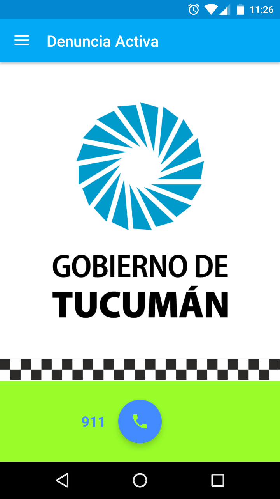
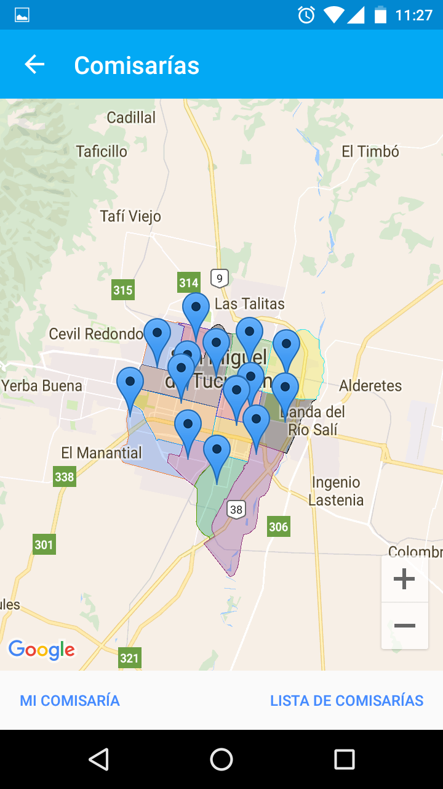
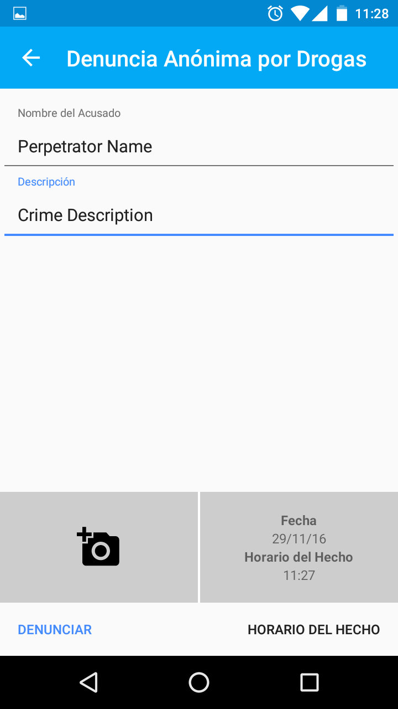

# Police Report Mobile (MinSegApp - Alerta Activa)

Init    |    Police Stations   |   Police Report  | Wanted
:-------------------------:|:-------------------------:|:-------------------------:|:-------------------------:|
  |    |   | 

## Description
Android app for citizens to report crimes, drugs, internal affairs, see nearby police stations and wanted/missing people.

## Contributing

1. Fork it!
2. Create your feature branch: `git checkout -b my-new-feature`
3. Commit your changes: `git commit -am 'Add some feature'`
4. Push to the branch: `git push origin my-new-feature`
5. Submit a pull request :D

## How to add a new police station
Have a look at them at [police-station.json](assets/police-station.json)

## How to build the code

First add these constants into your `home/.gradle/gradle.properties` file:

    # Google Capchta
    MinSegAppApiKeyCaptcha="your key"
    MinSegAppApiKeyCaptchaVerify="your key"

    # Google Maps Autocomplete
    MinSegAppMapsAutocomplete="your key"

    # Google Maps Android
    MinSegAppApiKeyGoogleMapsDebug="your key"
    MinSegAppApiKeyGoogleMapsRelease="your key"

## Dependencies
- [nv-websocket-client](https://github.com/TakahikoKawasaki/nv-websocket-client): High-quality WebSocket client implementation in Java.
- [MaterialSpinner](https://github.com/ganfra/MaterialSpinner): Spinner with Material Design - Down to API 9.
- [android-maps-utils](https://github.com/googlemaps/android-maps-utils): Handy extensions to the Google Maps Android API.
- [smart-location-lib](https://github.com/mrmans0n/smart-location-lib): Android library project that lets you manage the location updates to be as painless as possible.
- [android-async-http](https://github.com/loopj/android-async-http): An Asynchronous HTTP Library for Android.
- Volley: for Google.
- [android-saripaar](https://github.com/ragunathjawahar/android-saripaar): UI form validation library for Android.
- [Android-Lib-reCAPTCHA](https://github.com/ayltai/Android-Lib-reCAPTCHA/): The library wraps the reCAPTCHA API. .
- [picasso](https://github.com/square/picasso/): A powerful image downloading and caching library for Android.

## License

    Copyright 2016 Bruno Sarverry

    You may copy, distribute and modify the software as long as you track
    changes/dates in source files. Any modifications to or software including
    (via compiler) GPL-licensed code must also be made available under the GPL
    along with build & install instructions.

## Organization Keniobyte
Open source for Security Forces

[www.keniobyte.com](https://www.keniobyte.com/)

[info@keniobyte.com](mailto:info@keniobyte.com)

Tucumán, Argentina
